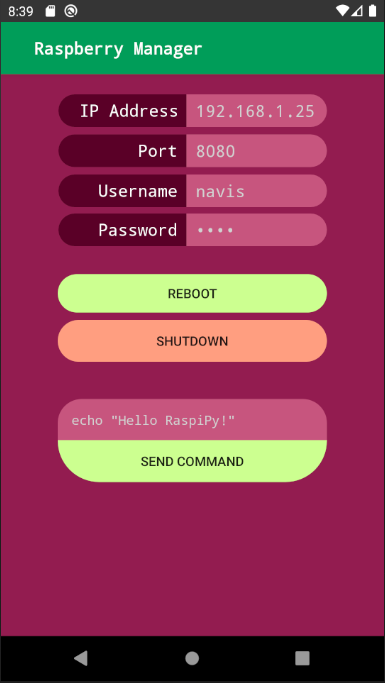

# Raspi Manager
Simple Android application for rebooting, shutting down and sending simple commands to my raspberry over a local network. 
I use this when I have not access to a SSH connection and want to manage my raspberry in a quick way.  

The applicatoin is not secure, it uses a simple TPC connection with non encrypted data. A python script on the raspberry pi acts as a TPC server listening on port 8080. 

## Additions

Things I will probably add in the future. This is a simple app I built for my personal use, for now it has all the functionalities I need.      
  
    
- [ ] Secure connection
- [ ] Raspberry PI response
- [ ] Sidebar 
- [ ] Load / Save configuration file
- [ ] User settings on server

    

